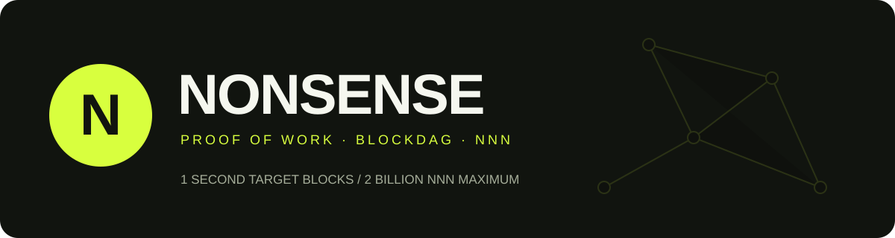

<p align="center">
  
</p>

<p align="center">
  <a href="https://github.com/nonsense-project/nonsense/releases"></a>
  <a href="https://github.com/nonsense-project/nonsense/actions/workflows/tests.yaml"></a>
  <a href="LICENSE"></a>
  
</p>

<p align="center">
  <a href="https://nonsense.rodeo">Website</a> ·
  <a href="https://explorer.nonsense.rodeo">Block explorer</a> ·
  <a href="https://github.com/nonsense-project/nonsense/releases/latest">CLI downloads</a> ·
  <a href="https://github.com/AltbaseWallet/AltbaseWallet/releases/latest">GUI downloads</a> ·
  <a href="https://discord.gg/YkF8DqkfM7">Discord</a> ·
  <a href="https://github.com/nonsense-project/nonsense/issues">Issues</a>
</p>

**Nonsense (NNN)** is an independent proof-of-work cryptocurrency built on a GHOSTDAG blockDAG. It is a fork of Karlsen, with its own genesis block, network identifiers, address prefixes, proof-of-work seed, and monetary parameters. Karlsen itself descends from Kaspa.

This repository contains the Go full node, `nonsensed`, and the command-line wallet, `nonsensewallet`, together with the consensus implementation, RPC interfaces, tests, and development tools. Published binary releases contain the **node and CLI wallet for Linux x64 and Windows x64**. GUI wallet downloads for Windows, Linux, and macOS are available from [Altbase Wallet](https://github.com/AltbaseWallet/AltbaseWallet/releases/latest).

[Specifications](#specifications) · [Emission](#emission) · [Proof of work](#proof-of-work) · [Run a node](#run-a-node) · [Use the wallet](#use-the-wallet) · [Build](#build-from-source) · [Architecture](#source-layout)

## Specifications

The values below describe the mainnet configuration shipped in this repository. Target timings are protocol parameters, not guarantees of wall-clock confirmation time.

| Property | Mainnet value |
|---|---|
| Name / ticker | **Nonsense / NNN** |
| Network name | `nonsense-mainnet` |
| Consensus | Proof of work with **GHOSTDAG** block ordering |
| Ledger | BlockDAG; UTXO transaction model |
| Proof of work | **FishHashPlus**, with an independent Nonsense seed and BLAKE3-based wrapping |
| Algorithm identifier | `nonsensehash-fishhashplus-1.0.0` |
| Target block interval | **1 second** |
| Maximum supply parameter | **2,000,000,000 NNN** |
| Precision | **8 decimals**; 1 NNN = 100,000,000 sompi |
| Initial base subsidy | **20 NNN** per eligible block |
| First deflationary base subsidy | **17.76465535 NNN** |
| Deflationary activation | DAA score **15,519,600** |
| Coinbase maturity | **100** consensus maturity units; approximately 100 target block intervals |
| Genesis timestamp | **2026-08-30 00:00:00 UTC** |
| Genesis allocation | **No spendable genesis outputs** |
| Founder premine | **Yes — early block rewards mined after daemon startup** |
| Premine amount | **Not yet disclosed** |
| Mainnet address prefix | `nonsense:` |
| Mainnet P2P / node RPC | TCP **39111** / **39110** |
| Local wallet daemon | **localhost:9182** by default |
| Mainnet network identifier | `0x28ec8381` |
| Default node storage | Pruned; `--archival` retains historical block data |
| License | **ISC** |

### Consensus and transaction parameters

| Parameter | Value |
|---|---|
| GHOSTDAG K | 18 |
| Maximum direct block parents | 10 |
| Merge-set size limit | 180 |
| Maximum block mass | 500,000 mass units |
| Mass per transaction byte | 1 |
| Mass per script-public-key byte | 10 |
| Mass per signature operation | 1,000 |
| Difficulty adjustment window | 2,641 blocks; minimum window length 10 |
| Timestamp deviation tolerance | 132 target intervals |
| Finality window parameter | 24 hours |
| Derived pruning depth | 185,798 target intervals, approximately 51.61 hours |
| Pruning proof M / merge depth | 1,000 / 3,600 |
| Maximum coinbase payload / script | 204 bytes / 150 bytes |
| Current transaction / script-public-key version | 0 / 0 |
| Active post-genesis block version | 2, with the V2 activation score set to 0 |
| Non-native subnetworks | Disabled on mainnet |

The mass limit is a weighted transaction-processing limit, not a fixed block-size limit in bytes. Throughput depends on transaction structure and network conditions; this release does not advertise a measured TPS figure. The 24-hour finality parameter describes the consensus window and should not be read as a wallet confirmation requirement.

Sources: [network parameters](domain/dagconfig/params.go), [consensus defaults](domain/dagconfig/consensus_defaults.go), [consensus constants](domain/consensus/utils/constants/constants.go).

## Emission

Nonsense has a 2 billion NNN maximum supply parameter and a declining subsidy schedule. Fees are paid by transactions and do not create additional coins.

1. **Initial phase:** the base subsidy is 20 NNN while the DAA score is below 15,519,600.
2. **Deflationary phase:** the first monthly base subsidy is 17.76465535 NNN. A schedule month spans 2,629,800 DAA-score units, equivalent to 30.4375 days at the target rate.
3. **Monthly reductions:** the integer subsidy table follows the formula below. Over twelve schedule months, the base subsidy is divided by 1.4, a reduction of approximately 28.57%.

```text
m = floor((DAA score - 15,519,600) / 2,629,800)
subsidy in sompi = floor(1,776,465,535 / 1.4^(m / 12))
```

Consensus uses the **precomputed integer table**, avoiding floating-point calculations during validation.

| Time from the start of the deflationary phase | Base subsidy |
|---|---|
| Start | 17.76465535 NNN |
| 12 schedule months | 12.68903953 NNN |
| 24 schedule months | 9.06359966 NNN |
| 60 schedule months | 3.30306110 NNN |
| 120 schedule months | 0.61415279 NNN |
| Schedule month 760 onward | 0 NNN |

At the one-second target rate, the initial phase spans about 179.625 days and the full subsidy schedule spans about 63.83 years. These are DAA-based estimates, not fixed calendar deadlines.

The schedule-accounting bound checked by the source tests is **1,999,999,998.67608000 NNN**, below the maximum supply parameter. It is not a measurement of circulating supply: genesis handling and DAG reward eligibility matter, and actual circulation is derived from the accepted UTXO set. A coinbase can aggregate rewards for eligible merge-set blocks, so its total output need not equal one base subsidy.

### Premine disclosure

**Nonsense has a founder premine.** The founder mined NNN after starting the daemon, accumulating early block rewards. These rewards are part of the normal emission schedule. **The exact premine amount has not yet been disclosed.**

The genesis transaction has no spendable outputs; the premine was accumulated through mining after genesis. The immutable genesis payload contains the historical text `no premine`, which must not be read as a claim that the founder did not mine coins after launching the daemon.

Sources: [subsidy schedule](domain/consensus/processes/coinbasemanager/coinbasemanager.go), [supply-bound test](domain/consensus/processes/coinbasemanager/coinbasemanager_test.go), [genesis definition](domain/dagconfig/genesis.go).

## Proof of work

Mainnet uses the V2 FishHashPlus path from its first post-genesis block. The implementation hashes the pre-PoW header, timestamp, padding, and nonce; processes the result through FishHashPlus; and applies the final BLAKE3-based PoW hash before comparing it with the difficulty target.

Nonsense uses this independent 32-byte seed:

```text
8b3f876e0caef02b836a401824203f324ca57207ba6c534309c574c836b445c1
```

The full dataset contains 37,748,717 items of 128 bytes: **4,831,835,776 bytes, approximately 4.50 GiB**, before other miner memory allocations. Node validation uses a light cache rather than the full mining dataset. Its raw cache payload is approximately 72 MiB, with additional runtime overhead.

Mining software must support Nonsense's seed, header format, and algorithm. Generic Karlsen or FishHash support alone does not establish compatibility. Development miner sources are available under `cmd/nonsenseminer`; miner executables are not included in the binary releases.

Sources: [PoW pipeline](domain/consensus/utils/pow/pow.go), [FishHash parameters](domain/consensus/utils/pow/fishhash.go), [FishHashPlus kernel](domain/consensus/utils/pow/fishhashplus_kernel.go).

## Download

Open the [latest release](https://github.com/nonsense-project/nonsense/releases/latest) and choose your platform:

| Archive | Executables |
|---|---|
| `nonsense-v2.3.0-linux-amd64.tar.gz` | `nonsensed`, `nonsensewallet` |
| `nonsense-v2.3.0-windows-amd64.zip` | `nonsensed.exe`, `nonsensewallet.exe` |

Archives also include the ISC license. `SHA256SUMS` contains the archive checksums. No miner, genesis generator, explorer, GUI wallet, or separate RPC command utility is bundled.

Linux:

```bash
sha256sum --check SHA256SUMS --ignore-missing
tar -xzf nonsense-v2.3.0-linux-amd64.tar.gz
cd nonsense-v2.3.0-linux-amd64
./nonsensed --version
./nonsensewallet version
```

Windows PowerShell:

```powershell
Get-FileHash .\nonsense-v2.3.0-windows-amd64.zip -Algorithm SHA256
Expand-Archive .\nonsense-v2.3.0-windows-amd64.zip -DestinationPath .
Set-Location .\nonsense-v2.3.0-windows-amd64
.\nonsensed.exe --version
.\nonsensewallet.exe version
```

On Windows, compare the displayed hash with the matching line in `SHA256SUMS`.

### GUI wallet downloads

Download the latest **Altbase Wallet** release for a desktop GUI:

| Platform | GUI wallet download |
|---|---|
| Windows | [Latest Altbase Wallet release](https://github.com/AltbaseWallet/AltbaseWallet/releases/latest) |
| Linux | [Latest Altbase Wallet release](https://github.com/AltbaseWallet/AltbaseWallet/releases/latest) |
| macOS | [Latest Altbase Wallet release](https://github.com/AltbaseWallet/AltbaseWallet/releases/latest) |

Choose the installer or archive for your operating system on the Altbase release page. Nonsense's own release archives contain `nonsensed` and `nonsensewallet` (the node and CLI wallet).

## Run a node

Start the mainnet node with a UTXO index for the wallet and bind RPC to the local machine:

```bash
./nonsensed --utxoindex --rpclisten=127.0.0.1:39110
```

Windows PowerShell:

```powershell
.\nonsensed.exe --utxoindex --rpclisten=127.0.0.1:39110
```

With no explicit peer options, a fresh mainnet node bootstraps from:

```text
145.63.129.88:39111
188.137.235.121:39111
```

DNS seed lists are currently empty. You can supply peers explicitly with repeated `--addpeer=HOST:39111` options. `--connect` restricts connections to your chosen peers; it cannot be combined with `--addpeer`.

Allow inbound TCP 39111 if you want the node to accept public peers. The node's raw default RPC binding is all interfaces, so the explicit loopback binding above is intentional. The node RPC and wallet daemon are local administrative interfaces and should not be exposed as public wallet services.

The node builds its PoW light cache on first use. Allow it to initialize and synchronize before relying on wallet balances. `--archival` retains historical block data and requires more disk space. Use `./nonsensed --help` for additional options.

### Data and configuration

| Data | Linux | Windows |
|---|---|---|
| Node application directory | `~/.nonsensed` | `%LOCALAPPDATA%\Nonsensed` |
| Node configuration | `~/.nonsensed/nonsensed.conf` | `%LOCALAPPDATA%\Nonsensed\nonsensed.conf` |
| Mainnet node data and logs | `~/.nonsensed/nonsense-mainnet/` | `%LOCALAPPDATA%\Nonsensed\nonsense-mainnet\` |
| Mainnet wallet keys | `~/.nonsensewallet/nonsense-mainnet/keys.json` | `%LOCALAPPDATA%\Nonsensewallet\nonsense-mainnet\keys.json` |

Use `--appdir` to select a node data location and wallet `--keys-file` options to select a wallet file. Wallet backups are separate from node data and must be retained when reinstalling or resynchronizing.

## Use the wallet

The CLI wallet provides local key management and a wallet daemon that connects to your node's RPC. The node must run with `--utxoindex`.

### 1. Create or restore

```bash
./nonsensewallet create
# To restore an existing compatible recovery phrase:
./nonsensewallet create --import
```

Follow the interactive prompts and keep a private backup of your recovery material and wallet file. The wallet supports 24-word BIP39 mnemonics, encrypted key files using Argon2id and XChaCha20-Poly1305, and HD address derivation.

### 2. Start the wallet daemon

In a second terminal, with the node already running:

```bash
./nonsensewallet start-daemon --rpcserver=127.0.0.1:39110 --listen=127.0.0.1:9182
```

Keep this process running while using wallet commands. The password is requested interactively when needed.

### 3. Receive and inspect

```bash
./nonsensewallet new-address
./nonsensewallet show-addresses
./nonsensewallet balance
```

Mainnet receiving addresses begin with `nonsense:`. Newly mined outputs must reach coinbase maturity before they can be spent.

### 4. Send

```bash
./nonsensewallet send --to-address=nonsense:REPLACE_WITH_RECIPIENT --send-amount=1.25
```

Use the recipient's complete valid address in place of the example. Amounts support up to eight decimal places. Advanced commands cover unsigned transaction creation, offline signing, broadcasting, fee replacement, sweeping, and multisignature wallets. See `./nonsensewallet --help` and `./nonsensewallet COMMAND --help`.

On Windows, use `.\nonsensewallet.exe` in place of `./nonsensewallet` in these commands.

### Derivation and compatibility

Current single-signer wallets derive from `m/44'/121337'/0'`; multisignature wallets use purpose `45'`. External and change branches are derived below the account key. The code also retains the legacy wallet-version-1 coin type `111111`, accessible through the relevant legacy import options. These are implementation parameters, not a claim that Nonsense has a registered SLIP-0044 coin type.

Address prefixes and network identifiers differ from the upstream networks. Use Nonsense-compatible wallet software and the correct network when restoring keys.

## Networks and genesis

| Network | CLI selection | P2P | Node RPC | Address prefix |
|---|---|---|---|---|
| Mainnet | Default | 39111 | 39110 | `nonsense:` |
| Testnet | `--testnet` | 39211 | 39210 | `nonsensetest:` |
| Simnet | `--simnet` | 39511 | 39510 | `nonsensesim:` |
| Devnet | `--devnet` | 39611 | 39610 | `nonsensedev:` |

These networks have separate genesis blocks. The table lists source configurations, not a promise of publicly available test-network peers. Pass matching network flags to both node and wallet.

Mainnet genesis block hash:

```text
b6a9f4543fe8038b6122c3ac7db38b97600f1e24357a72cab5f031b16d40bc4f
```

Mainnet genesis transaction merkle root:

```text
0bbc4d1fecae80a1f3ddd29244067b64e140303120c2a45ef93a50cefe322303
```

## Build from source

The module path is `github.com/nonsense-project/nonsense/v2`. The `/v2` suffix is Go's major-version namespace; clone the repository without that suffix.

Release builds use **Go 1.26.8**, a C compiler for CGO, and Python 3.11+ for packaging. The module records its toolchain in `go.mod`.

```bash
git clone https://github.com/nonsense-project/nonsense.git
cd nonsense
go mod download
go mod verify
mkdir -p bin
go build -trimpath -o bin/nonsensed .
go build -trimpath -o bin/nonsensewallet ./cmd/nonsensewallet
```

For both release targets on Debian/Ubuntu:

```bash
sudo apt-get install build-essential gcc-mingw-w64-x86-64 python3
python3 scripts/build_release.py --version v2.3.0
```

Or build one target:

```bash
python3 scripts/build_release.py --target linux-amd64 --version v2.3.0
python3 scripts/build_release.py --target windows-amd64 --version v2.3.0
```

The script places archives under `dist/`, uses static external linking, and builds exactly `.` and `./cmd/nonsensewallet`. Linux builds require a Linux host. Windows builds can use MinGW on Linux or a CGO-capable Windows build environment.

### Tests

```bash
go test -short -p 2 -parallel 2 -timeout 30m ./...
```

The repository also includes longer consensus and stability scenarios. The full suite can require substantial RAM and runtime; use `NO_PARALLEL=1 ./build_and_test.sh` to serialize it. CI validates the core packages and builds the two supported release targets.

## Source layout

| Directory | Contents |
|---|---|
| `app/` | Node lifecycle, P2P flows, message types, RPC handlers |
| `domain/consensus/` | GHOSTDAG, validation, PoW, pruning, difficulty, subsidies |
| `domain/dagconfig/` | Network parameters and genesis definitions |
| `infrastructure/` | Configuration, storage, networking, logging |
| `cmd/nonsensewallet/` | CLI wallet, wallet daemon, key handling, signing |
| `cmd/nonsensectl/` | Source for the RPC command-line utility |
| `cmd/nonsenseminer/` | Development miner sources |
| `util/` | Addresses, amounts, transaction mass, supporting utilities |
| `stability-tests/` | Multi-node and consensus scenarios |
| `scripts/` | Release packaging |

This publication starts from the source snapshot recovered from the deployed Nonsense node. That snapshot did not contain Git history; the repository does not recreate or claim the missing upstream history. Consensus and network parameters are preserved, while module references, release packaging, and documentation are maintained here.

## Contributing and license

Open issues and pull requests in [nonsense-project/nonsense](https://github.com/nonsense-project/nonsense). See [CONTRIBUTING.md](CONTRIBUTING.md) for development guidance.

Nonsense is distributed under the [ISC license](LICENSE). Attribution to the Karlsen, Kaspa, btcsuite, Decred, and Conformal contributors is retained in the source and license. Dependencies remain under their respective licenses.
